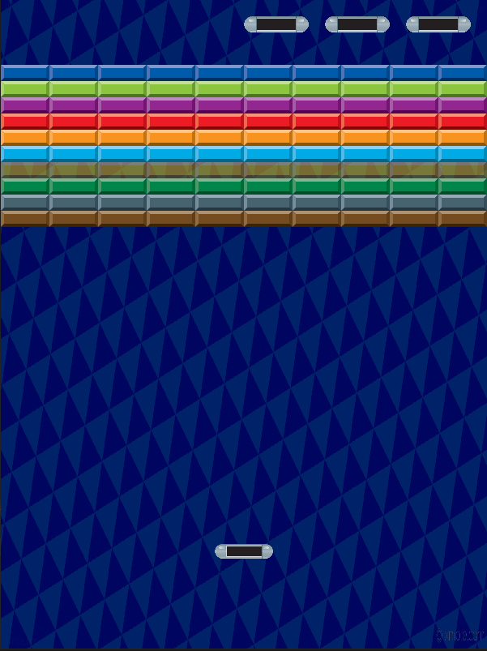
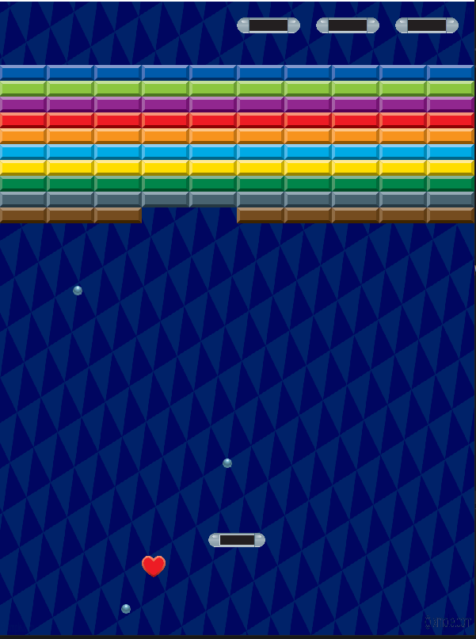
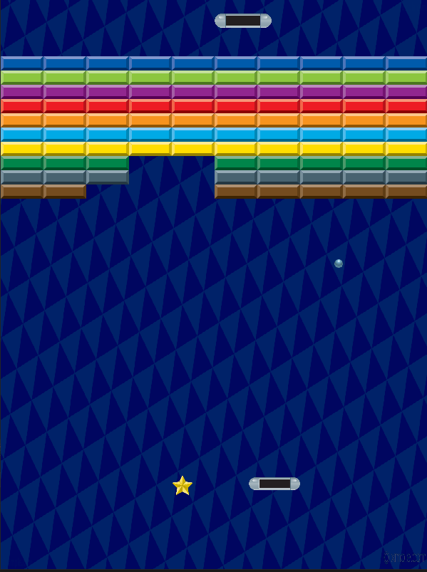
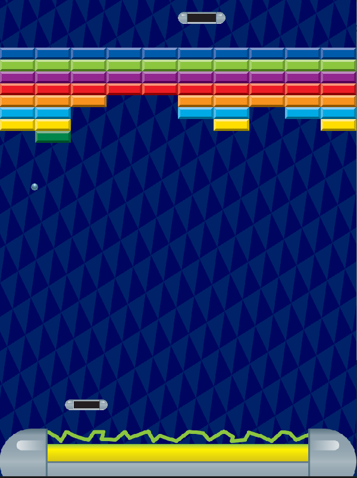

# Pseudo Arkanoid
###this is a simple clone of the game with a simple custom level.  In order to begin a player has to click the left mouse button and 3 balls will be launched consecutively  in the direction of the mouse(the operation is supposed to be repeated each time the player looses a life). 
## Added features to the original Breakout
* The player initially shoots with multiple balls (3 balls);
* Yellow blocks have an ability to become transparent with an interval of transparency for 3 seconds and of solid state for 10 seconds;
* Abilities are spawned from random  destroyed blocks;
* 2 types of abilities "saving wall" (gets activated by catching a heart) an "damaging star"
(gets activated by catching a star)
## Gameplay Examples:

